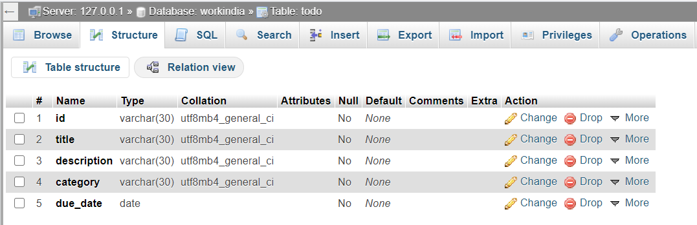

# WorkIndia Assesment - Backend

## Steps:

## Part I - Get it running

### (1) Install a web server

This is the application that runs in the background and processes HTTP protocol requests.
I have used [XAMPP](https://www.apachefriends.org/download.html) webserver.

Start the server.

Now visit http://127.0.0.1:5000/ 
A message -  "Workindia Assesment" shoudl be displayed if the server is running and responding correctly.

### (2) Install the application requirements
    
    pip install -r requirements.txt
    pip install des

### (3) Setting Up databse(MYSQL) in the web server for the application.
- Permissions and table structures 
   * host = "localhost"
   * user = "root"
   * password = ""
   * db = "workindia"
 - No. of tables used = 2
    * ## agents
    
    
    * ## todo
    

Run app.py - This starts our WSGI interface module and connects to the web server.

### (4) Try the APIs

* http://127.0.0.1:5000/
* http://127.0.0.1:5000/app/agent
* http://127.0.0.1:5000/app/agent/auth
* http://127.0.0.1:5000/app/agent/list
* http://127.0.0.1:5000/app/sites
